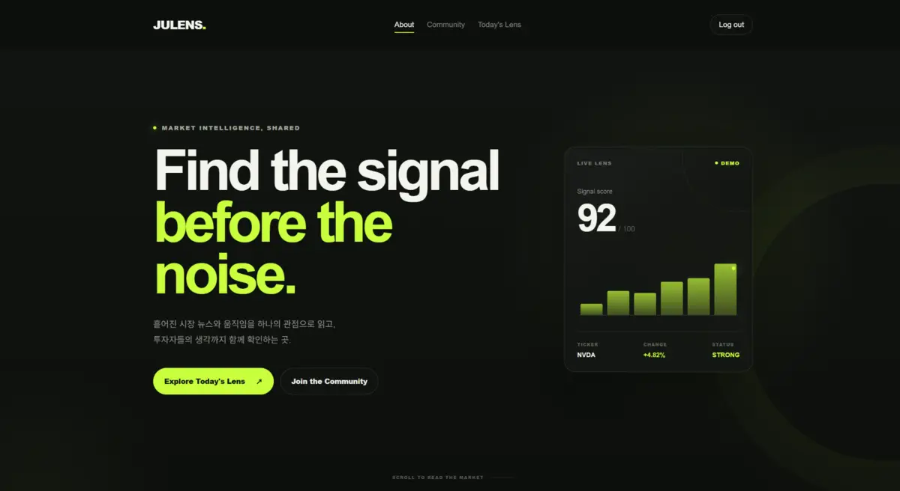
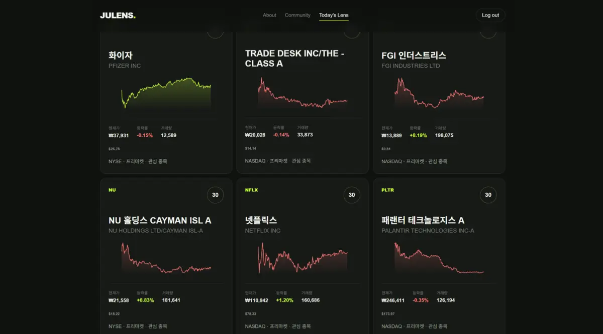
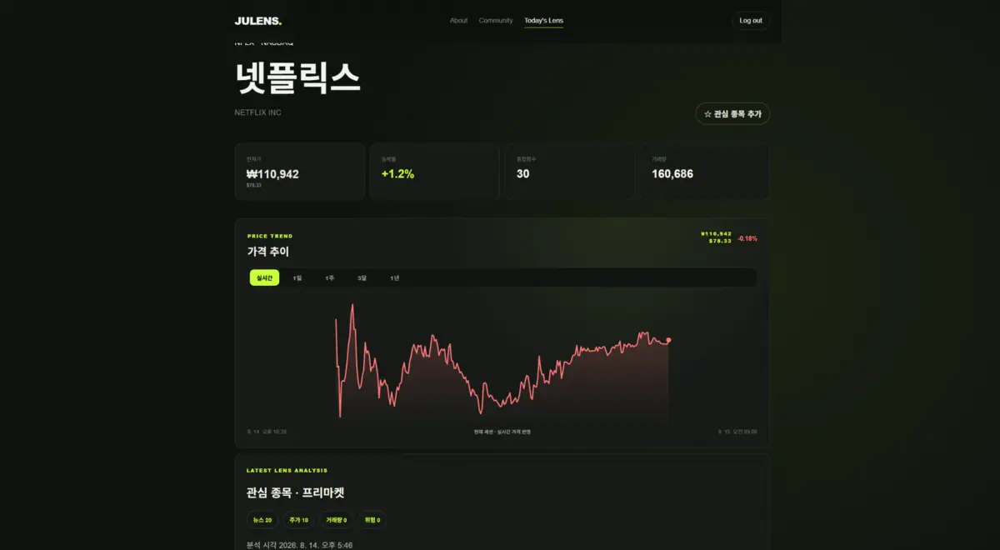
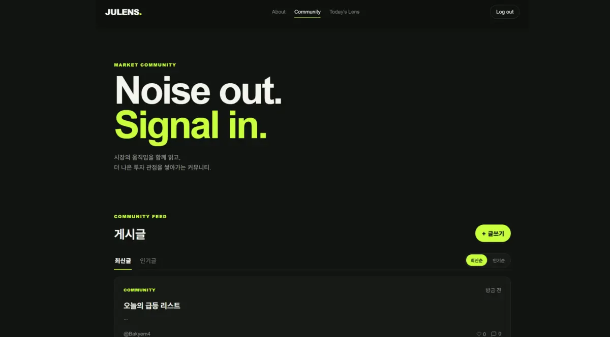
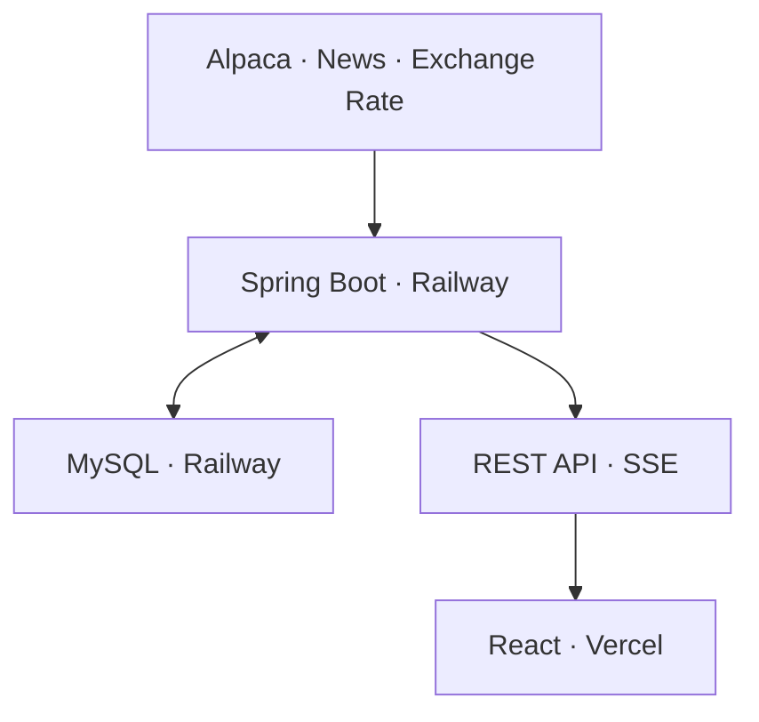

# JULens

> 시장의 소음 속에서 먼저 신호를 발견하는 미국 주식 분석·커뮤니티 서비스

JULens는 프리마켓부터 정규장과 Overnight까지 미국 주식 데이터를 수집하고,
뉴스·가격·거래량을 종합 분석해 투자 후보를 탐색할 수 있도록 돕는 주식 인텔리전스 서비스입니다.

- Frontend: [jaeminbag/JULens-client](https://github.com/jaeminbag/JULens-client)
- Backend: [jaeminbag/JULens-server](https://github.com/jaeminbag/JULens-server)
- Live Demo: [https://ju-lens-client.vercel.app](https://ju-lens-client.vercel.app)



## 프로젝트 배경

미국 주식은 정규장뿐 아니라 프리마켓과 Overnight에서도 가격이 움직입니다. 하지만 투자 후보를 찾으려면 가격, 거래량, 뉴스와 여러 거래 세션의 정보를 각각 확인해야 합니다.

JULens는 흩어진 시장 정보를 한 화면에서 확인하고, 시가총액이 큰 종목뿐 아니라 거래량이 급증한 저가·소형 종목까지 탐색할 수 있도록 개발했습니다. 사용자는 분석 점수와 가격 흐름을 확인한 뒤 관심 종목으로 저장하거나 커뮤니티에서 다른 투자자의 관점을 함께 확인할 수 있습니다.

## 주요 기능

### 1. Today’s Lens



- Alpaca 거래량 상위 종목을 기반으로 분석 후보 선정
- 종합점수·이름·거래량·가격 기준 정렬
- 종목명 검색 및 가격대 필터
- 저가·소형·고거래량 종목을 포함한 투자 후보 탐색
- 카드별 가격 추이와 원화·달러 가격 동시 표시

### 2. 종목 상세 분석



- 현재가, 등락률, 거래량과 Lens 종합점수 제공
- 실시간·1일·1주·3개월·1년 가격 추이 조회
- 프리마켓과 정규장 세션을 고려한 실시간 차트
- 원화를 주 가격으로, 달러를 보조 가격으로 표시
- 관련 뉴스와 뉴스·가격·거래량 기반 Lens 분석 제공
- 사용자별 관심 종목 추가 및 삭제

### 3. 실시간 가격 반영

- 무료 Alpaca IEX WebSocket으로 실시간 체결 데이터 수신
- Alpaca Overnight 참고 호가와 IEX 데이터를 시간대에 따라 통합
- Spring Boot 서버가 최신 가격을 관리하고 SSE로 브라우저에 전달
- 브라우저 `EventSource` 자동 재연결 지원
- SSE 지연 시 `/stocks/realtime/latest` 보조 조회로 서버의 최신 가격 반영
- 실제 체결 또는 호가가 변경된 경우에만 가격 갱신

### 4. 투자 커뮤니티



- 게시글 작성·조회·수정·삭제
- 최신순 및 인기순 게시글 탐색
- 댓글과 좋아요를 통한 의견 공유
- 로그인 사용자 기반 작성 권한 관리

## 기술 스택

| 영역 | 기술 | 사용 목적 |
| --- | --- | --- |
| Frontend | React 19, React Router 7, Vite 8 | SPA 화면 구성과 라우팅, 개발·빌드 환경 |
| Realtime UI | EventSource, Custom SVG Chart | SSE 가격 구독과 기간별 선 그래프 렌더링 |
| Backend | Java 21, Spring Boot 4.1 | REST API, 분석 서비스, 실시간 데이터 처리 |
| Security | Spring Security, JWT | 인증과 사용자별 접근 제어 |
| Database | Spring Data JPA, MySQL, HikariCP | 회원·게시글·관심 종목·주식 분석 데이터 관리 |
| Market Data | Alpaca IEX WebSocket, Alpaca Market Data API | 실시간 가격, Overnight 호가, 가격 이력 수집 |
| API Docs | Springdoc OpenAPI | API 명세 확인 |
| Deployment | Vercel, Railway | 프론트엔드·백엔드·MySQL 운영 환경 배포 |

## 시스템 구조



### 실시간 가격 흐름

1. 백엔드가 Alpaca IEX WebSocket의 체결 데이터와 Overnight 참고 호가를 수신합니다.
2. `CompositeRealtimeStockPriceFeed`가 현재 시간대에 맞는 가격 피드를 선택합니다.
3. `RealtimeStockPriceService`가 종목별 최신 가격을 관리합니다.
4. `/stocks/realtime` SSE가 가격 이벤트를 React 클라이언트로 전달합니다.
5. 클라이언트는 현재가와 실시간 차트에 같은 가격 이벤트를 적용합니다.
6. 스트림이 지연되면 `/stocks/realtime/latest`를 조회해 서버가 가진 최신 가격을 보완합니다.

## 핵심 문제 해결

### 1. 외부 API 호출로 인한 HikariCP 커넥션 풀 고갈

**문제**

```text
HikariPool-1 - Connection is not available, request timed out after 30003ms
(total=10, active=10, idle=0, waiting=1)
```

Alpaca와 뉴스 API 등 외부 네트워크 요청이 장시간 트랜잭션 안에서 실행되면서, 응답을 기다리는 동안 DB 커넥션까지 계속 점유했습니다.

**해결**

- 외부 API 호출을 트랜잭션 밖으로 분리
- DB 조회·저장 구간에만 짧은 트랜잭션 적용
- 조회와 저장 책임을 별도 서비스로 분리
- OSIV 비활성화 및 HikariCP 누수 감지 설정 추가

이를 통해 분석 기능은 유지하면서 외부 API 응답 시간이 DB 커넥션 점유 시간으로 이어지지 않도록 개선했습니다.

### 2. 새로고침 전까지 실시간 가격이 갱신되지 않는 문제

**문제**

새 SSE 구독자가 서버의 기존 최신 가격을 즉시 받지 못해 다음 체결까지 기다렸고, 하트비트가 없어 배포 프록시가 연결을 끊거나 이벤트를 버퍼링할 가능성이 있었습니다.

**해결**

- 연결 직후 서버가 보유한 최신 가격 전송
- SSE 응답에 캐시 및 프록시 버퍼링 방지 헤더 적용
- 15초 주기의 keep-alive 하트비트 추가
- 연결 종료 시 구독과 하트비트 작업 정리
- 프론트엔드 `EventSource` 자동 재연결 유지
- 5초 주기의 최신 가격 REST 보조 조회 추가

보조 조회는 가격을 임의로 생성하지 않고 서버가 실제로 수신한 마지막 가격만 반영합니다.

### 3. 현재가와 그래프 마지막 값의 불일치

**문제**

현재가와 그래프가 서로 다른 데이터 소스를 우선 사용해 같은 화면에서 서로 다른 가격을 표시했습니다.

**해결**

```text
SSE 실시간 가격 → 가격 이력의 마지막 지점 → 기존 분석 가격
```

현재가와 그래프에 공통 데이터 우선순위를 적용하고, 실시간 가격 이벤트를 두 영역에 함께 반영해 표시 값을 동기화했습니다.

### 4. 회사명 자동 음역 오류

**문제**

`CLASS A`가 `클래스 애`로, `HYPERSCALE`이 잘못된 음역으로 변환되는 등 금융 데이터의 영문 회사명을 일반 음역 규칙만으로 처리하기 어려웠습니다. DB에 기존 한글명이 있으면 잘못된 값도 계속 보존됐습니다.

**해결**

- 운영 DB의 활성 종목 4,973개를 읽어 공개 종목명 카탈로그와 티커 기준으로 대조
- 4,971개를 자동 매칭하고 미매칭 2개는 직접 검증해 보완
- 검증된 한글명 카탈로그를 정적 리소스로 관리해 외부 번역 API 의존 제거
- `SURG → 서지페이스`처럼 서비스 기준과 다른 표기는 정확한 예외 매핑을 우선 적용
- AMD, ADT, AT&T처럼 약칭 자체가 공식 명칭인 경우에는 억지 음역 없이 원문 유지
- 시작 시 종목 동기화 과정에서 기존 DB의 잘못된 이름도 함께 갱신

운영 환경에서 전체 4,973개 종목을 다시 조회해 빈 회사명이 없고, 의도한 예외를 제외한 종목명이 기준 카탈로그와 일치하는지 검증했습니다.

## 데이터 범위와 한계

JULens의 실시간 가격은 무료 Alpaca IEX 데이터를 사용합니다. IEX 데이터는 미국 전체 거래소의 모든 체결을 포함하지 않기 때문에 종목과 시간대에 따라 가격 변화가 적을 수 있습니다.

Overnight 가격은 실시간 체결가가 아니라 참고 호가의 중간값입니다. JULens는 이러한 데이터 특성을 화면에 구분해 표시하며, 실제 데이터가 없는 구간에 임의 가격을 생성하지 않습니다.

## 배포

| 구성 요소 | 플랫폼 | 주소 |
| --- | --- | --- |
| Frontend | Vercel | [JULens 서비스](https://ju-lens-client.vercel.app) |
| Backend | Railway | [JULens API](https://julens-server-production.up.railway.app) |
| Database | Railway MySQL | 외부에 직접 노출하지 않고 백엔드에서만 접근 |

프론트엔드는 `VITE_API_BASE_URL`을 통해 운영 백엔드를 참조하며, API Key와 데이터베이스 인증 정보는 각 배포 환경의 환경변수로 관리합니다.

## 로컬 실행

### Frontend

```bash
npm install
npm run dev
```

기본 API 주소는 `http://localhost:8080`이며, 다른 서버를 사용할 때는 환경변수를 설정합니다.

```env
VITE_API_BASE_URL=http://localhost:8080
```

프로덕션 빌드와 정적 검사는 다음 명령으로 실행합니다.

```bash
npm run lint
npm run build
```

### Backend

백엔드는 Java 21과 MySQL이 필요합니다. API Key와 DB 접속 정보는 소스 코드에 저장하지 않고 환경변수로 주입해야 합니다.

```bash
./gradlew bootRun
```

세부 서버 코드와 실행 설정은 [백엔드 저장소](https://github.com/jaeminbag/JULens-server)에서 확인할 수 있습니다.

## 향후 개선 계획

- 외부 API 장애 상황에 대한 사용자 오류 메시지 개선
- 분석 및 실시간 가격 처리 로직의 자동 테스트 확대
- 모바일·태블릿 반응형 레이아웃 개선
- 분석 배치 성능과 외부 API 호출량 모니터링

## 기여

Spring Boot 기반 분석 서버와 React 프론트엔드를 구현했습니다. Alpaca 실시간 스트림 연동, 종목 분석 배치, 기간별 가격 차트, 커뮤니티와 관심 종목 기능을 개발했으며 HikariCP 커넥션 풀 고갈, SSE 연결 유지, 현재가와 차트 불일치 문제를 직접 분석하고 해결했습니다.
