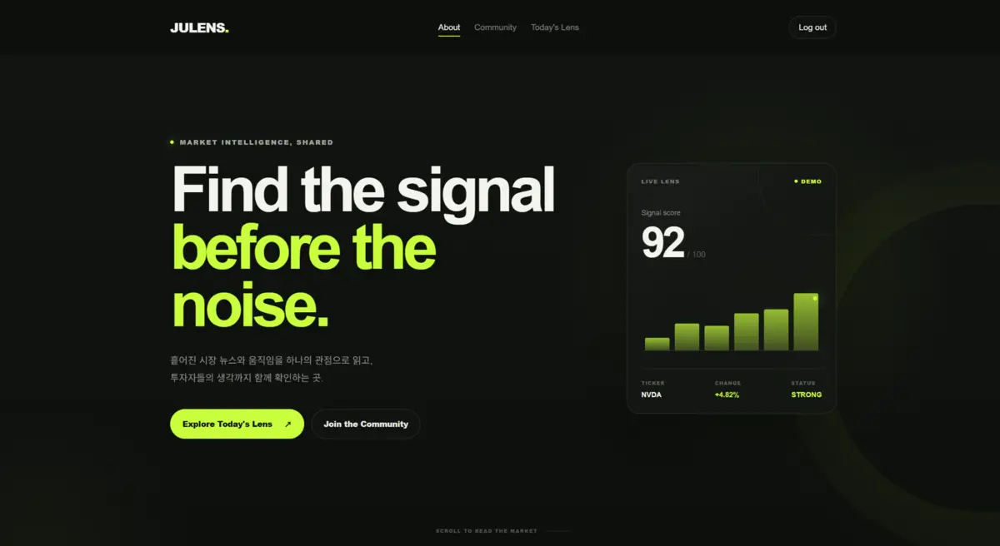

# JULens Client

> JULens 서비스의 백엔드 API 연동과 실시간 데이터 시각화를 위해 구현한 React 프론트엔드입니다.

핵심 백엔드 아키텍처, 트랜잭션 분리, SSE 연결 관리와 API 설계 과정은 [JULens-server 저장소](https://github.com/jaeminbag/JULens-server)에서 확인할 수 있습니다.

- [Backend Repository](https://github.com/jaeminbag/JULens-server)
- [Live Demo](https://ju-lens-client.vercel.app)



## 로컬 실행

```bash
npm install
npm run dev
```

기본 API 주소는 `http://localhost:8080`입니다. 다른 서버를 사용할 때는 환경변수를 설정합니다.

```env
VITE_API_BASE_URL=http://localhost:8080
```
